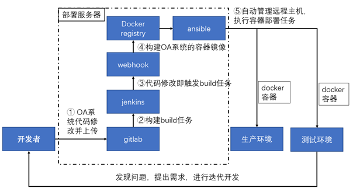

# devops
## what
Devops = development + operations， 用于促进开发、技术运营和质量保障部门之间的沟通、协作与整合。
DevOps 是一个完整的面向IT运维的工作流，以 IT 自动化以及持续集成（CI）、持续部署（CD）为基础，来优化程式开发、测试、系统运维等所有环节。
DevOps考虑的还不止是软件部署。它是一套针对这几个部门间沟通与协作问题的流程和方法。
## why
传统的模式 —— 开发 -> 测试 -> 发布

风险：易变性、不确定性、复杂性、模糊性
**效率**与**质量** 都很重要。
软件敏捷开发
提高跨部门的合作效率
缩短提交代码到正式部署上线时间，降低风险
让软件整个生命周期处于可部署的状态
让交付过程变得可靠、可预期、可视化的过程

在很长一段时间开发和运维是一个硬币的两面，看起来双方分工清晰，需要较少的协同。然而现代的软件开发、部署运行越来越多的采用分布式架构、集群环境，这就要求开发人员同运维人员的技能出现了必要的交集，双方需要紧密协作才能确保应用的正常运行。随着越来越多的企业IT部门的团队在项目中采用敏捷过程进行应用的迭代开发，DevOps流程和工具集的集成应用将不仅帮助团队有效的提升产品代码质量，同时大大提高交付速度。

开发人员需求：
持续代码修订、快速修复缺陷
快速响应需求、加快特性交付

运维人员需求：
减少频繁更新、确保应用持续稳定运行
自动化基础设置配置管理，持续监控告警
提供可以自助的应用部署服务

不同的需求导致的冲突：
需要改变：软件开发就是一个变化的过程(新功能、Bug缺陷修复)，业务要求快速变化迭代
惧怕改变：一旦软件部署到生产环境，确保其稳定运行，避免变动

## how
- Ansible
http://www.ansible.com.cn/
- Gitlab
https://about.gitlab.com/
- Jenkins
https://jenkins.io/
- Webhook
https://www.cnblogs.com/kevingrace/p/6479813.html
- Docker
http://www.docker.org.cn/

结合现有的工具，提出的一个架构

