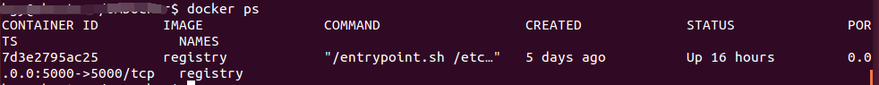
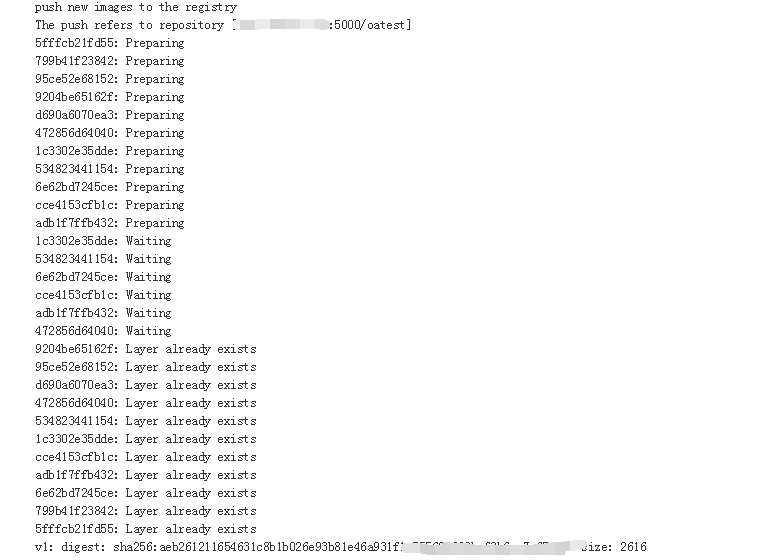
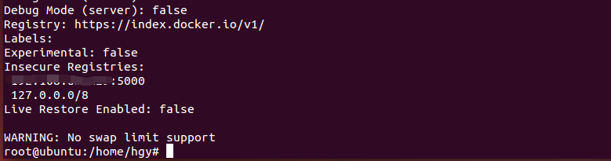
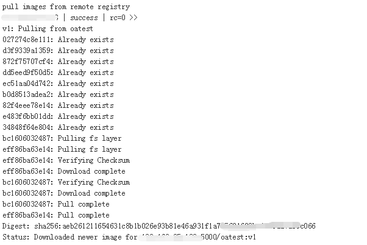

1. 在本机构建私有仓库
```
docker run -d -p 5000:5000 --name registry -v /opt/data/registry:/tmp/registry registry
```
这个容器始终一直运行在后台。


 将容器发送到私有仓库
```shell
# 假设现有的容器name为oatest, tag为latest
docker tag oatest:latest $RegistryIP:5000/$CONTAINER_NAME:$VERSION
docker push $RegistryIP:5000/$CONTAINER_NAME:$VERSION
```

3. 远程主机设置私有仓库的源
在`/etc/docker/daemon.json`中加上相关的源配置的信息。
```
{ "insecure-registries":  ["$RegistryIP:5000"] }
# "$RegistryIP需替换为实际的IP地址。
```
重启docker。
```
sudo service docker restart
```
可以通过docker info来查看源的设置。


4. 远程主机向私有仓库拉取对应的镜像

```shell
docker pull $RegistryIP:5000/$CONTAINER_NAME:$VERSION
```


5. 更新仓库中的镜像
仓库中的镜像其实也是有层级缓存的。所以当你push一个name和tag都一致的镜像时，会用到之前的镜像层，然后上传的速度也会加快。
这里要注意的是，一旦要删除仓库里的镜像时，就没那么简单了。
