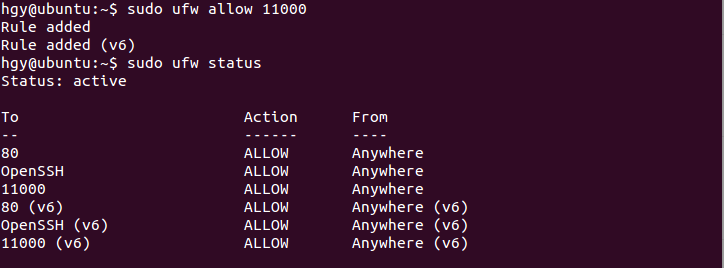
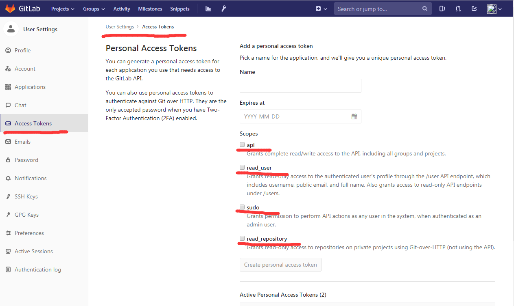
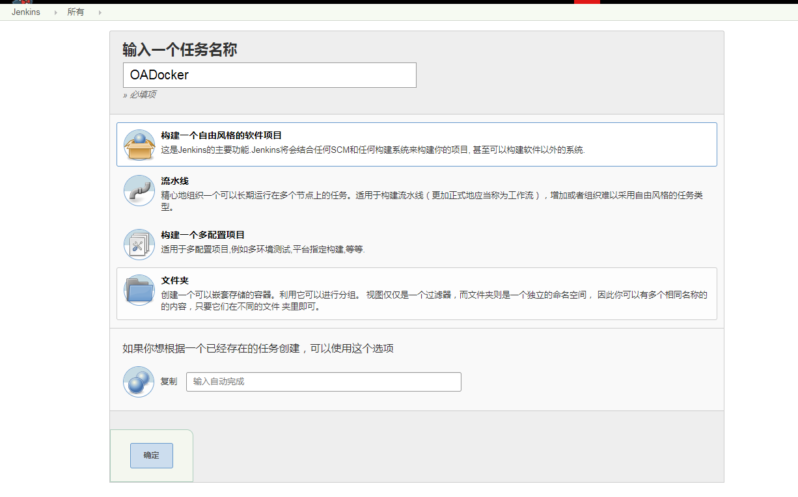
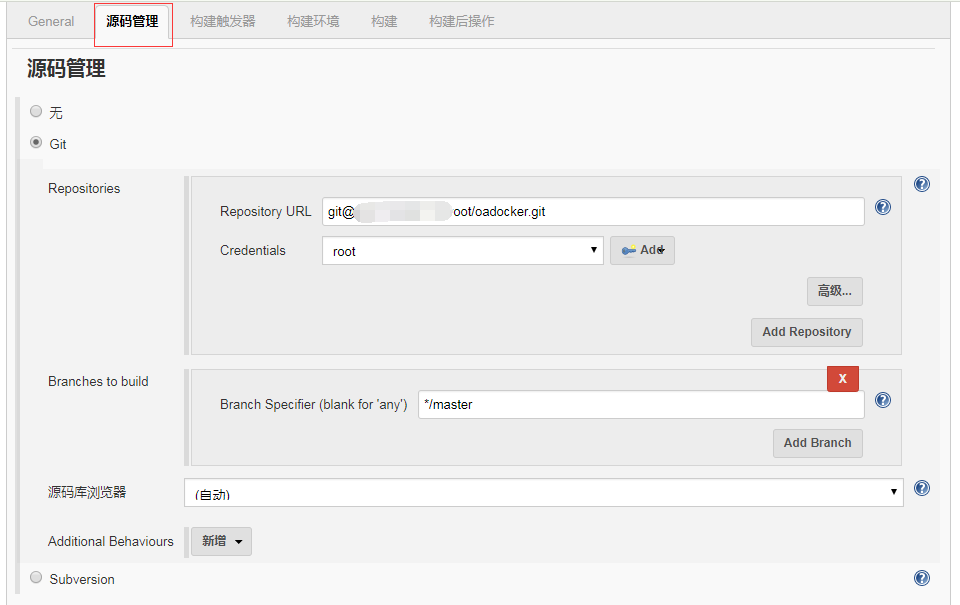
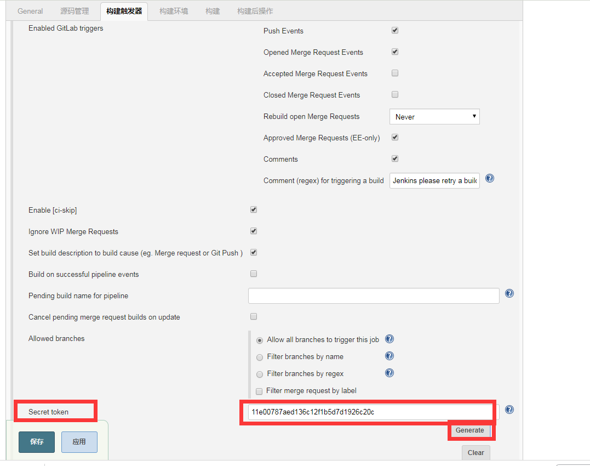
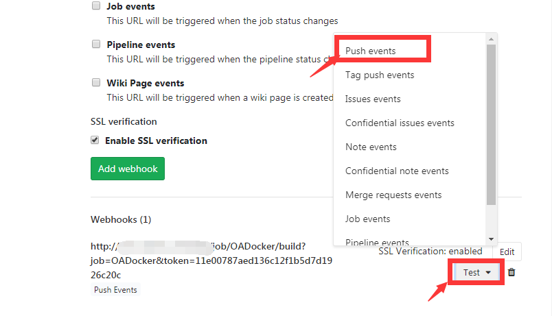
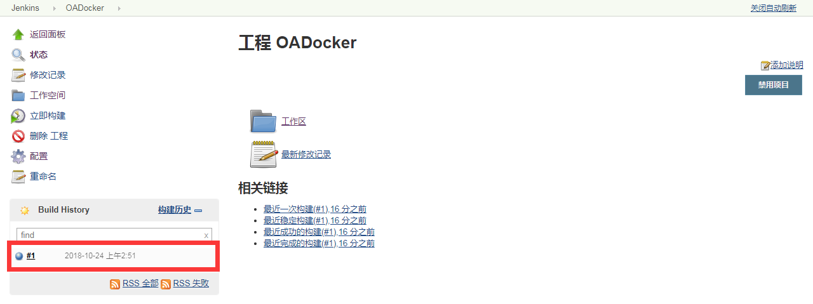

## 搭建gitlab+jenkins+webhooks自动部署环境
### 概述
gitlab+jenkins+webhooks构建自动部署的项目的教程网上都有很多。我找了好几个教程一起看，然后也配好了相关的环境。多余重复的东西就不赘述了，把过程中遇到的问题提一下，希望不会再踩坑吧。

### 访问权限问题
在配置这个环境的时候，其实我是将gitlab和jenkins放在两台服务器上部署。潜在的一个问题在于可能在内网里是无法访问到gitlab或者jenkins。

解决方案：
- gitlab需要修改配置文件。并且更新配置。
配置文件为`/etc/gitlab/gitlab.rb`
```
external_url
nginx[‘listen_address’]
nginx['listen_port']
...
```
最后reconfigure一次即可。
```
sudo gitlab-ctl reconfigure
```
- gitlab所在的服务器需要配置防火墙。
ufw防火墙配置设置。

- jenkins部署安装完就可以直接在内网访问了。


### GitLab webhook URL
目前webhook设置那里有点问题。
下面的这些报错我都遇到过。
* Hook executed successfully but returned HTTP 500
* Hook executed successfully but returned HTTP 404
* Hook executed successfully but returned HTTP 403
* ...

可能的原因是
1. webhook的链接没写对。页面上提供的gitlab webhook url其实是有点问题的，我试了好几次都不成功。后面给出解决方案。
2. 没有填secret token。secret在Advance选项里面，要点击`generate`按钮。
3. 项目的URL与secret token不对应。每个项目都有对应的webhook，对应着url和secret token。
4. jenkins没有设置全局安全设置。
在jenkins->全局安全配置->跨站请求伪造保护不做勾选以及jenkins->全局安全配置授权策略选择任何用户可以做任何事情。

总结：
自己构造了一个url，完美的解决了这些问题。填完jenkins上build任务的configure后，就可以构造这个url了。
http://192.168.85.129:8080/job/build-to-dev/build?job=build-to-dev&token=9574059e050d088dc239cba3e9ae6ee6

测试：
成功添加webhook之后，我们可以点击`Test`按钮，gitlab会模拟一次push操作，然后发送一个post请求到jenkins，去执行build任务。如果成功的话，HTTP返回码会返回200或者201。同时，我们可以在jenkins的对应job下看到构建的记录。这样一来，就成功了。

### gitlab API token
刚开始一直找不到，怎么都找不到，因为按着教程的页面根本没有。原因可能是因为版本不同，然后导致界面的设置也不一样。我说一下我这个版本在哪里找这个gitlab api token。


## gitlab-jenkins的凭证
jenkins所在的服务器的ssh密钥要放在gitlab上保存，用于免密码下载源码。填写的时候是在源码管理那里，填写git项目的地址，然后凭证选择SSH密钥。然后在jenkins上要创建凭证，用于让gitlab能够访问jenkins。

### 流程
1. 我们在gitlab上上传项目。就是正常的创建项目那种。
2. 我们在jenkins上新建任务。填写相应的信息。



然后再填写一些build时要执行的操作，build执行后要执行的操作。最后保存即可。
3. 我们在gitlab上创建webhook

4. 进行测试，看看返回值，还有jenkins上有没有在build。

