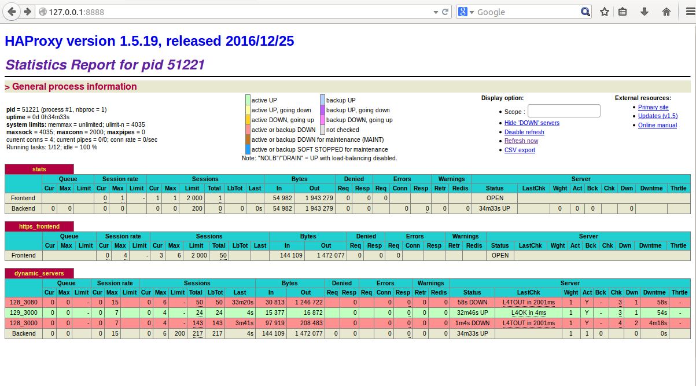

## 需求
有一个web应用的项目，单独部署在容器里，对于部署的主机开放端口(例如3000， 或者3080)。然后我们希望考虑到项目的高可用性，尝试使用负载均衡的解决方案。

## 实现效果
我们在多台主机上跑这个容器，也可能是同一个主机上跑多个容器，只要端口不冲突即可，然后使用haproxy，配置相关的文件，当其中一台容器或者一个主机挂了之后，haproxy会自动选择可用的服务，使得整个项目服务具有高可用性。

## 实践
### 环境
- 主机1：192.168.85.129，部署了一个容器，开放端口为3000。
- 主机2：192.168.85.128，部署了两个容器，开放端口为3000和3080.
- 主机3：运行haproxy，可检测相关主机的现象

### 操作记录
以下操作主要是在主机3中进行。主机3的操作系统为ubuntu14.04.
1. 安装Haproxy1.5
```shell
sudo add-apt-repository ppa:vbernat/haproxy-1.5
sudo apt-get update
sudo apt-get dist-upgrade
sudo apt-get install haproxy
```
2. 配置haproxy
配置文件在`/etc/haproxy/haproxy.cfg`下。
在原始的版本中加入了web监控配置`listen  stats`、前端配置`frontend https_frontend`以及后端配置`backend dynamic_servers`。
希望通过web页面来监控所有的server实时的状况。然后后端配置用于多个server的选择。

```
global
	log /dev/log	local0
	log /dev/log	local1 notice
	chroot /var/lib/haproxy
	stats socket /run/haproxy/admin.sock mode 660 level admin
	stats timeout 30s
	user haproxy
	group haproxy
	daemon

	# Default SSL material locations
	ca-base /etc/ssl/certs
	crt-base /etc/ssl/private

	# Default ciphers to use on SSL-enabled listening sockets.
	# For more information, see ciphers(1SSL). This list is from:
	#  https://hynek.me/articles/hardening-your-web-servers-ssl-ciphers/
	ssl-default-bind-ciphers ECDH+AESGCM:DH+AESGCM:ECDH+AES256:DH+AES256:ECDH+AES128:DH+AES:ECDH+3DES:DH+3DES:RSA+AESGCM:RSA+AES:RSA+3DES:!aNULL:!MD5:!DSS
	ssl-default-bind-options no-sslv3

defaults
	log	global
	mode	http
	option	httplog
	option	dontlognull
        timeout connect 5000
        timeout client  50000
        timeout server  50000
	errorfile 400 /etc/haproxy/errors/400.http
	errorfile 403 /etc/haproxy/errors/403.http
	errorfile 408 /etc/haproxy/errors/408.http
	errorfile 500 /etc/haproxy/errors/500.http
	errorfile 502 /etc/haproxy/errors/502.http
	errorfile 503 /etc/haproxy/errors/503.http
	errorfile 504 /etc/haproxy/errors/504.http

listen  stats
        bind    0.0.0.0:8888
        stats   refresh 30s
        stats   uri /
        stats   realm   baison-test-Haproxy
        stats   auth    chianyu:cyadmin
        bind-process    1

frontend https_frontend
        bind *:9090
        default_backend dynamic_servers

backend dynamic_servers
        mode http
        #option httpclose
        #option forwardfor header X-Forwarded-For
        #appsession JSESSIONID len 52 timeout 30m
        balance source
        server 128_3080 192.168.85.128:3080 check
        server 129_3000 192.168.85.129:3000 check
        server 128_3000 192.168.85.128:3000 check
```

3. 配置完成后，重启haproxy。
每次修改完配置文件都建议重启haproxy。直接使用命令行service haproxy restart即可。

4. 效果
这个是网页监控图，如果某一台主机宕机，可以立刻在界面上看到。也可以看到此时所有的流量是转发到哪一台主机上。可以支持动态刷新状态。

来测试一下，我们看到现在用的是128_3000这台主机，当他挂掉之后，看看能否转移到129这台主机上。


根据我们的配置信息可知，如果要看应用的话，直接访问'127.0.0.1:9090'即可。
