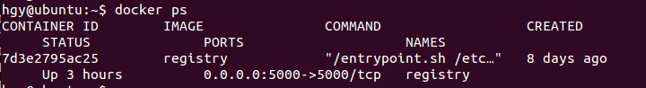

硬件配置
- 主机1：192.168.85.128 ubuntu 跑生产环境测试
- 主机2：192.168.85.129 ubuntu_backup 跑jenkins，docker等
- 主机3：192.168.85.130 ubuntu111 跑haproxy，gitlab等

## GitLab
访问url：192.168.85.130:11000

- Dockerfile 为构建docker的文件
- run.sh, buildJdk.sh, jdk-6u45-linux-x64.bin为构建容器内运行环境的必要软件和脚本
- GF_2015_OA_8080文件夹为项目文件
- 模拟构建了三个分支，分别为master, develop, test

## Jenkins

这里构建了两个job文件，每一个job对应一个分支，也就是说当分支出现修改时才会触发到这个job的自动执行。不同分支不会互相受到影响。

这个job是由于远程的分支代码有了更新，因此触发了job的执行。

我们可以在jenkins上查看日志。

## Docker

我在主机2上构建了一个私有仓库。可以存储镜像，然后远程主机可以便捷的拉取对应的容器镜像，缩减了镜像打包、构建的时间。

远程主机从私有仓库下载镜像成功后，可以启动。然后用户访问IP:PORT即可。

## Haproxy
这个是网页监控图，如果某一台主机宕机，可以立刻在界面上看到。也可以看到此时所有的流量是转发到哪一台主机上。可以支持动态刷新状态。

来测试一下，我们看到现在用的是128_3000这台主机，当他挂掉之后，看看能否转移到129这台主机上。

根据我们的配置信息可知，如果要看应用的话，直接访问'127.0.0.1:9090'即可。

## OA系统运行截图

程序能够成功跑起来。
