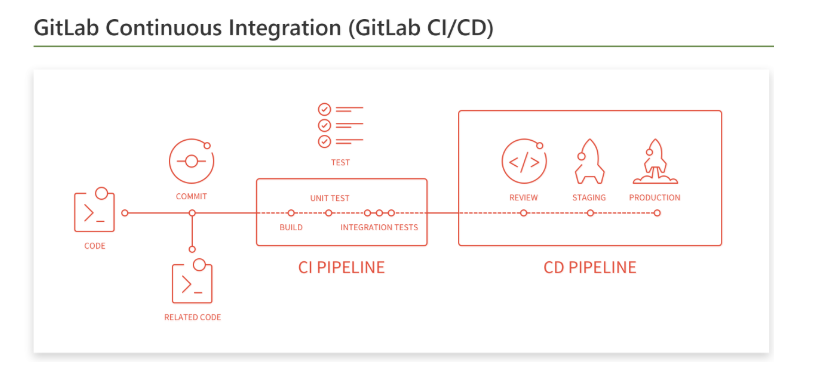

## 今日任务
- (已完成)了解整个项目的框架,将项目放到gitlab上
- (已完成)搭建gitlab+jenkins+webhooks+docker环境
- (已完成)用项目apache来测试自动部署的功能
- (已完成)输出文档 gitlab_jenkins_webhooks自动部署.md

## 记录
GitLab webhook URL
目前webhook设置那里有点问题。
Hook executed successfully but returned HTTP 500

http://192.168.85.129:8080/job/test/
忽然测试到原来是那个链接有问题，真是有毒。要确保链接进去的是可以访问的url。

设置了web hooks后，当git项目触发了event后会往你填写的hooks URL发送一个post请求

自己构造了一个url，完美的解决了
http://192.168.85.129:8080/job/build-to-dev/build?job=build-to-dev&token=9574059e050d088dc239cba3e9ae6ee6

目前可以实现的效果是
  - 一旦开发人员修改代码并上传到gitlab
  - webhook会被触发，
  - 发送一个post请求到jenkins指定的URL上，执行build任务
  - build任务主要是拉取git项目代码，构建docker容器镜像，启动容器，端口重定向(环境部署)
  - 然后就可以使用系统了。


停止所有的容器
```
docker stop $(docker ps -q)
```
删除所有的容器
```
docker rm $(docker ps -aq)
```





km.war
http://192.168.85.129:8080/job/km-war/build?job=km-war&token=1c7c600e81d190374d06529add9ed95b
