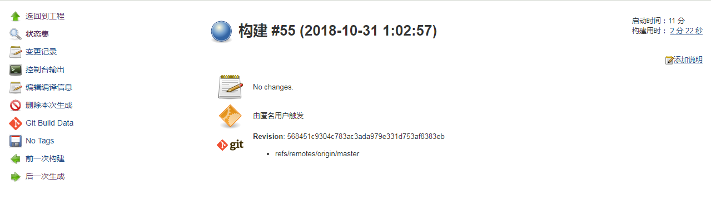

## 今日任务
- (已完成)根据不同的分支 来build不同的任务
- 万一容器挂了怎么办， 万一主机挂了怎么办
- 万一程序运行报错了怎么看，看log文件。运维人员怎么运维
- 了解项目架构

## 记录
1. 万一容器挂了怎么办

  -- restart=always
  ```
  docker run -p 3000:8080 --restart=always -d 192.168.85.129:5000/oatest:v1
  ```
  尝试关机再开机，容器会自己启动
  除非你自己手动去stop了它，不然还是会一直启动
  默认情况下容器是不重启的，–restart标志会检查容器的退出码来决定容器是否重启容器。

   -v /opt/data/oalog:/oa/GF_2015_OA_8080/standalone/log
   docker exec -it containerID /bin/bash

2. 项目架构
|  bin:Unix和Win环境下的启动脚本和启动配置文件
|  bundles:存放OSGI bundle
|  docs/schema:存放xml.schema文件
|  domain:（domain）域模式的配置文件、部署内容和可写区域等。
    |  configuration:domain模式的所有配置文件
    |  data/content:主机控制器内部工作区，内部存储部署内容的地方，用户不能操作这个目录（PS：域模式不支持扫描文件系统来部署内容）。
    |  lib/ext:利用扩展列表机制安装的library jar的存放位置
    |  log:日志文件
    |  servers:应用服务器实例可写区域，每一个应用服务器实例都有它们自己的目录，当服务器第一次启动时创建，在每个服务器的目录内包含以下的子目录。
        |  data:服务器写入信息区
        |  log:日志文件
        |  tmp:临时文件

|  modules:存放各种模块（PS：7是基于模块化的类加载架构）。
|  standalone:standalone模式的配置文件，部署内容和可写区域等。
    |  configuration:standalone模式的配置文件
    |  data:服务器写入的持久化信息，如通过web管理控制台或CLI部署的项目存放在content目录下。
    |  deployments：用户部署内容存放目录，服务器运行时能自动侦测和部署这些内容。
    |  lib/ext:利用扩展列表机制安装的library jar的存放位置
    |  log:日志文件
    |  tmp:临时文件
|  welcome-content:欢迎界面

3.  万一程序运行报错了怎么看，运维人员怎么运维
看log文件。用了volume挂载。在ubuntu上就可以看到log信息。如果容器删掉了，log信息依然在。

4. 挂了的情况讨论
容器挂了
  原因：脚本启动失败，主机突然关机
  解决方案：一般交付的是整个运行的环境，如果成功的话，不会出现脚本启动失败的情况啊，万一还是启动失败了，可以进入容器，手动执行脚本
  ```
  docker run -it containerID /bin/bash
  docker logs containerID
  ```
主机挂了
  原因：网络突然不通，主机突然断电重启，主机内存不足，主机突然死机
  解决方案：容器自动重启； 换一台主机部署，将容器部署到另一台主机上


现在容器数量还比较少，当容器数量变多的时候，可能需要考虑到
  - 端口冲突问题
  -  网络连通问题
  -  数据共享问题

5. 不同分支需要push，互不影响

http://192.168.85.129:8080/job/OADocker/build?job=OADocker&token=11e00787aed136c12f1b5d7d1926c20c
http://192.168.85.129:8080/gitlab/build_now

之前不可以的原因是那个url出了点问题，无法识别是哪一个branch。换了个url之后，发现可以识别远程主机以及对应修改的branch




还有变更记录可以查看


